# 🧭 RELATÓRIO – MEU PRIMEIRO APP NO KUBERNETES

## 📚 Sumário

- [📘 Capítulo 1 – Preparação do ambiente](#-capítulo-1--preparação-do-ambiente)
- [📗 Capítulo 2 – Criando e testando um Pod isolado](#-capítulo-2--criando-e-testando-um-pod-isolado)
- [📙 Capítulo 3 – Criando um Deployment (alta disponibilidade)](#-capítulo-3--criando-um-deployment-alta-disponibilidade)
- [📒 Capítulo 4 – Expondo a aplicação com um Service](#-capítulo-4--expondo-a-aplicação-com-um-service)
- [📕 Capítulo 5 – Testando auto-recuperação e escalabilidade](#-capítulo-5--testando-auto-recuperação-e-escalabilidade)
- [📓 Capítulo 6 – Conclusões e análise](#-capítulo-6--conclusões-e-análise)
- [🧾 Resumo visual de comandos](#-resumo-visual-de-comandos)
- [👨‍💻 Autor](#-autor)

---

## 📘 CAPÍTULO 1 – Preparação do Ambiente

### 🧩 Objetivo

Ativar e verificar se o Kubernetes está funcionando corretamente no Docker Desktop.

### 🔧 Passos

1. Abra o **Docker Desktop** → vá em **Settings > Kubernetes** → marque **Enable Kubernetes** → aguarde até o status aparecer como **running**.
2. Verifique via terminal:

   ```bash
   kubectl version --client
   kubectl cluster-info
   kubectl get nodes
   ```

✅ **Resultado do `kubectl get nodes` com o status “Running”:**

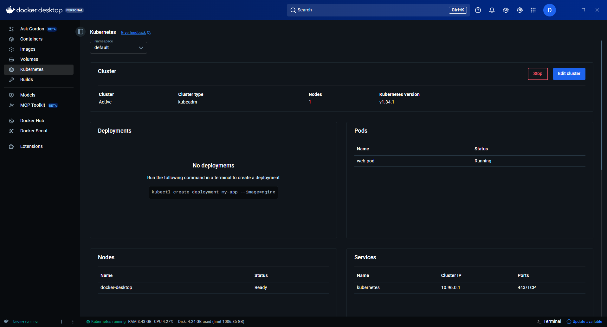

✅ **Resultado via terminal com status "READY":**

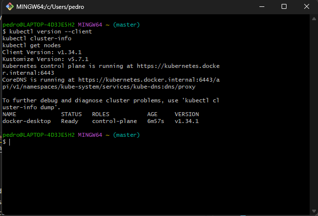

### 🧠 Explicação

O comando `kubectl get nodes` lista os nós do cluster Kubernetes.
No Docker Desktop, há apenas um nó local (_single-node_), que executa todos os componentes principais do cluster (API Server, Scheduler, Controller Manager, etc).

---

## 📗 CAPÍTULO 2 – Criando e testando um Pod isolado

### 🧩 Objetivo

Criar um **Pod** simples e observar que ele é uma unidade única — se cair, o Kubernetes **não o recria automaticamente**.

### 🧱 Arquivo: `pod-web.yaml`

```yaml
apiVersion: v1
kind: Pod
metadata:
  name: web-pod
  labels:
    app: meuapp
spec:
  containers:
    - name: web-container
      image: nginx
      ports:
        - containerPort: 80
```

### 🔧 Comandos

```bash
kubectl apply -f pod-web.yaml
kubectl get pods
kubectl describe pod web-pod
```

✅ **Resultado do `kubectl get pods` (mostrando STATUS “Running”):**

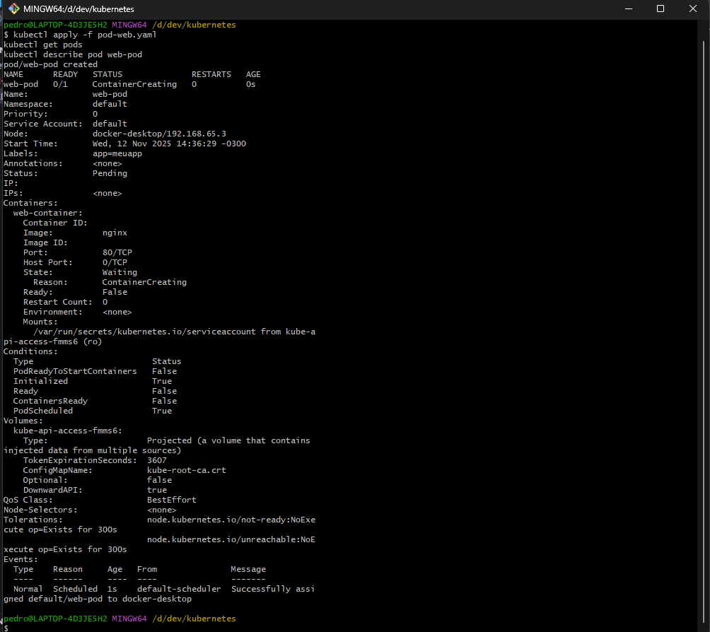

✅ **Docker Desktop (mostrando IP e container criado):**

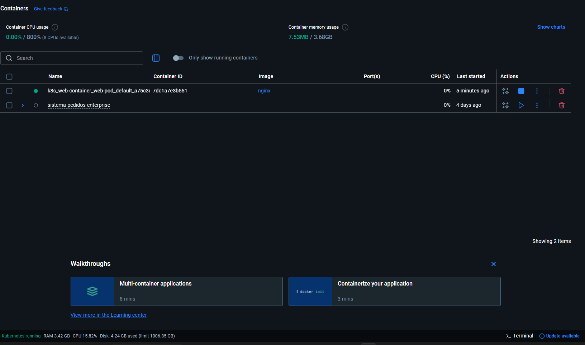

### 🧠 Explicação

Um **Pod** é a menor unidade executável no Kubernetes. Ele encapsula um container (ou vários, mas normalmente um só).
Aqui criamos um Pod com **NGINX**, mas ele **não é resiliente** — se for deletado, o Kubernetes **não o recria automaticamente**.

---

## 📙 CAPÍTULO 3 – Criando um Deployment (alta disponibilidade)

### 🧩 Objetivo

Ver como o **Deployment** gerencia automaticamente os Pods, garantindo que a aplicação se mantenha disponível.

### 🧱 Arquivo: `deployment-web.yaml`

```yaml
apiVersion: apps/v1
kind: Deployment
metadata:
  name: web-deployment
spec:
  replicas: 2
  selector:
    matchLabels:
      app: webapp
  template:
    metadata:
      labels:
        app: webapp
    spec:
      containers:
        - name: nginx
          image: nginx
          ports:
            - containerPort: 80
```

### 🔧 Comandos

```bash
kubectl apply -f deployment-web.yaml
kubectl get deployments
kubectl get pods
```

✅ **Kubectl get deployments (com 2/2 disponíveis):**

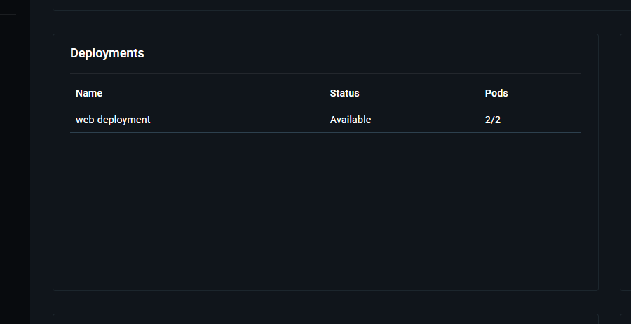

✅ **Kubectl get pods (mostrando os dois Pods criados pelo deployment):**

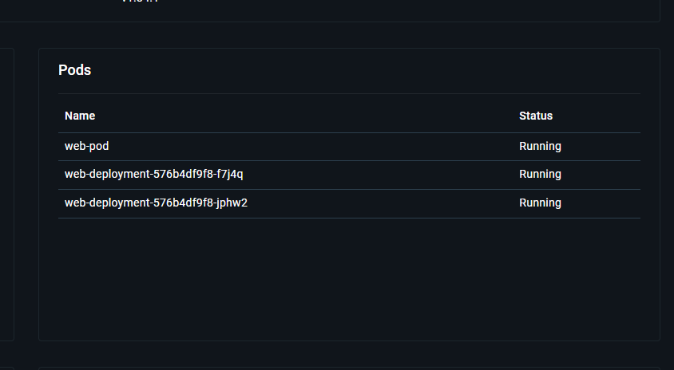

### 🧠 Explicação

Um **Deployment** cria e gerencia réplicas de Pods.
Se um Pod for deletado manualmente, o controlador do Deployment cria **automaticamente outro** para manter a quantidade desejada, garantindo **alta disponibilidade**.

---

## 📒 CAPÍTULO 4 – Expondo a aplicação com um Service

### 🧩 Objetivo

Permitir o acesso externo ao app **NGINX** via **Service** do tipo `NodePort`.

### 🧱 Arquivo: `service-web.yaml`

```yaml
apiVersion: v1
kind: Service
metadata:
  name: web-service
spec:
  type: NodePort
  selector:
    app: webapp
  ports:
    - port: 80
      targetPort: 80
      nodePort: 30080
```

### 🔧 Comandos

```bash
kubectl apply -f service-web.yaml
kubectl get services
```

✅ **Kubectl get services (com o IP e a porta 30080):**

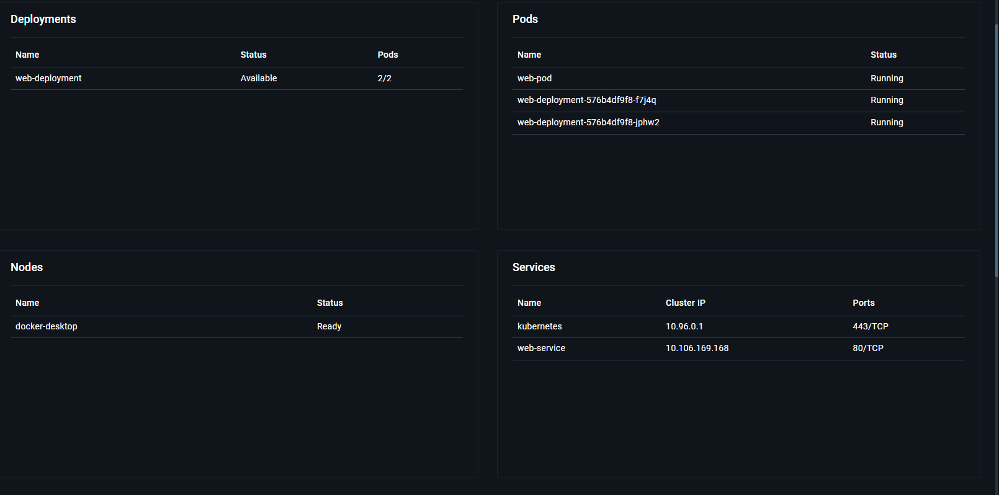

Acesse no navegador:
👉 [http://localhost:30080](http://localhost:30080)

✅ **Página padrão do NGINX carregando:**

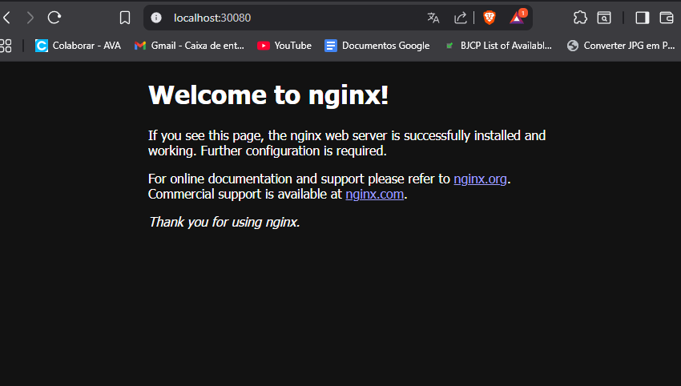

### 🧠 Explicação

O **Service** cria uma camada de rede estável para acessar os Pods, mesmo que mudem de IP.
Com `NodePort`, o Kubernetes abre uma porta no nó (no caso, o Docker local) e encaminha o tráfego para os Pods ativos.

---

## 📕 CAPÍTULO 5 – Testando auto-recuperação e escalabilidade

### 🧩 Objetivo

Observar o comportamento do Kubernetes quando há **falhas** e quando **escalamos** o app.

### 🔧 Passos

1. Liste os pods:

   ```bash
   kubectl get pods
   ```

2. Delete um deles:

   ```bash
   kubectl delete pod <nome-do-pod>
   ```

3. Observe novamente:

   ```bash
   kubectl get pods -w
   ```

✅ **Substituição automática do Pod (um novo sendo criado):**

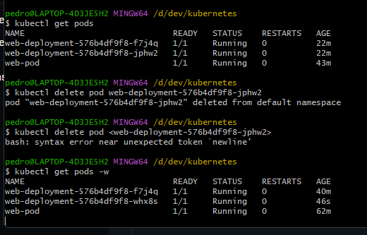

### 🧠 Explicação

O **Deployment** monitora constantemente o número de réplicas configuradas.
Se um Pod for excluído ou falhar, o controlador detecta e cria outro automaticamente — garantindo **disponibilidade e resiliência**.

---

### 🔼 Escalando o Deployment

```bash
kubectl scale deployment web-deployment --replicas=4
kubectl get pods
```

✅ **Os 4 Pods rodando:**

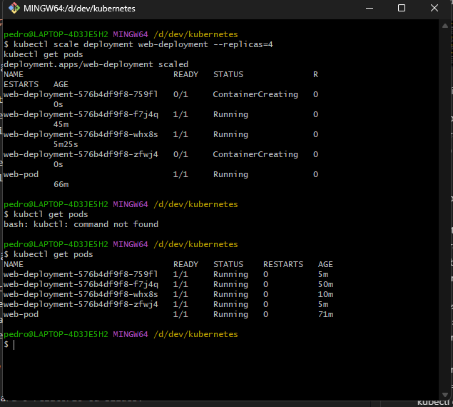

### 🧠 Explicação

O comando `scale` aumenta o número de réplicas, criando novos Pods para **balancear a carga**.
O **Service** distribui automaticamente as requisições entre as réplicas, garantindo **alta disponibilidade e distribuição inteligente de tráfego**.

---

## 📓 CAPÍTULO 6 – Conclusões e análise

### 📊 Resumo conceitual

| Conceito       | Função principal                                  | Observação                   |
| -------------- | ------------------------------------------------- | ---------------------------- |
| **Pod**        | Unidade básica de execução (1 ou mais containers) | Não se recria sozinho        |
| **Deployment** | Controla réplicas e atualizações                  | Garante resiliência          |
| **Service**    | Expõe e conecta Pods                              | Faz balanceamento            |
| **Escala**     | Aumenta réplicas dinamicamente                    | Garante alta disponibilidade |

---

## 🧩 Visão geral (Mermaid)

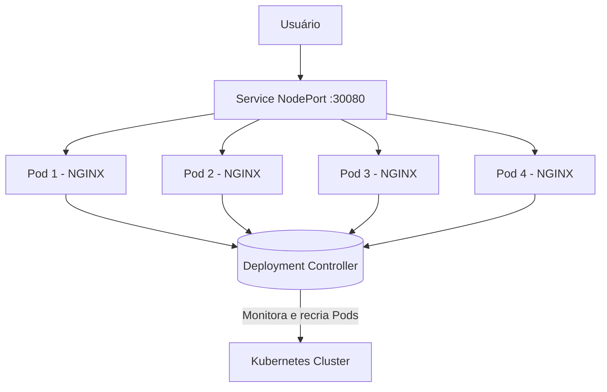

> O diagrama mostra como o **usuário acessa a aplicação** via _Service NodePort_, que direciona o tráfego para as **réplicas gerenciadas pelo Deployment**, enquanto o **Kubernetes Cluster** monitora e mantém tudo saudável.

---

## 🧾 RESUMO VISUAL DE COMANDOS

### 📂 Pods

```bash
kubectl apply -f pod-web.yaml
kubectl get pods
kubectl describe pod web-pod
kubectl delete pod web-pod
```

### 🏗️ Deployments

```bash
kubectl apply -f deployment-web.yaml
kubectl get deployments
kubectl delete deployment web-deployment
kubectl scale deployment web-deployment --replicas=4
```

### 🌐 Services

```bash
kubectl apply -f service-web.yaml
kubectl get services
kubectl delete service web-service
```

### 🔍 Monitoramento geral

```bash
kubectl get all
kubectl get pods -w
kubectl describe <objeto>
kubectl logs <nome-do-pod>
```

---

## 👨‍💻 Autor

**Pedro Paulo Damasceno Muniz**
🎓 Estudante de **Análise e Desenvolvimento de Sistemas – Uniasselvi – Blumenau**

📎 GitHub: [Damasceno11](https://github.com/Damasceno11)

🔗 LinkedIn: [Pedro Damasceno](https://www.linkedin.com/in/pedro-damasceno-23b330150/)

---
